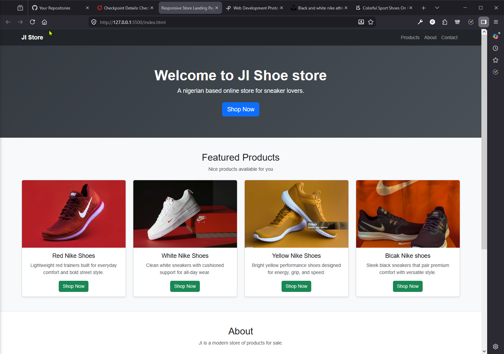

# Responsive Store Landing Page Design

## Objective
The objective of this project is to create a responsive landing page for an online store. The landing page includes a header, product section, and footer, focusing on a visually appealing design that looks good on various screen sizes.

## Requirements
- **HTML Structure**: The landing page is structured with a header, product section, and footer, including placeholder content for each section.
- **CSS Styling**: The CSS file styles the landing page with a clean and attractive design, ensuring responsiveness for both desktop and mobile devices.
- **Navigation Menu**: A navigation menu is implemented in the header with links to different sections of the page.
- **Product Section**: The product section contains at least four product cards, each featuring an image, product name, brief description, and a "Shop Now" button.
- **Responsive Design**: Media queries are utilized to create a responsive layout that adjusts for various screen sizes, ensuring mobile-friendliness.

## Design Choices
The design choices were made to enhance user experience and visual appeal, while keeping it simple. The layout is clean and organized, with a focus on usability by applying bootstrap.The use of a CSS framework, bootstrap will enhance the responsiveness and styling of the landing page.

